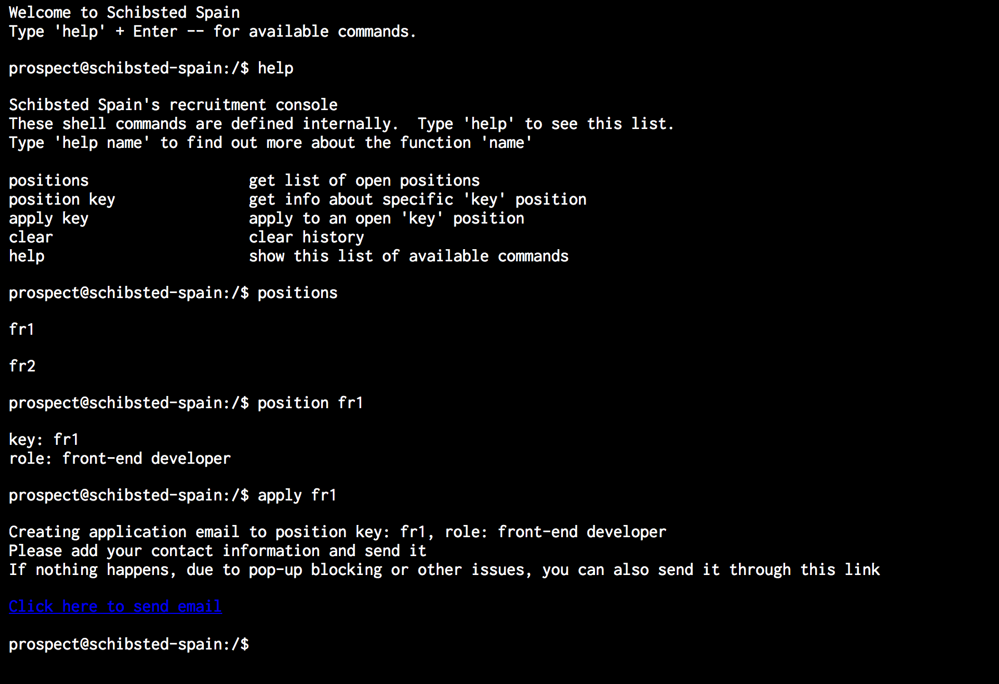

# Javascript Terminal Emulation

It simulates a terminal, which you can easily extend with your own commands.
In the example, it's used to mimic a console application where a possible candidates can issue commands to get further info about current vacancies, and even submit an application

It's so basic it can even be server from a GitHub page... https://lordkhizir.github.io/js-terminal-emulator/

